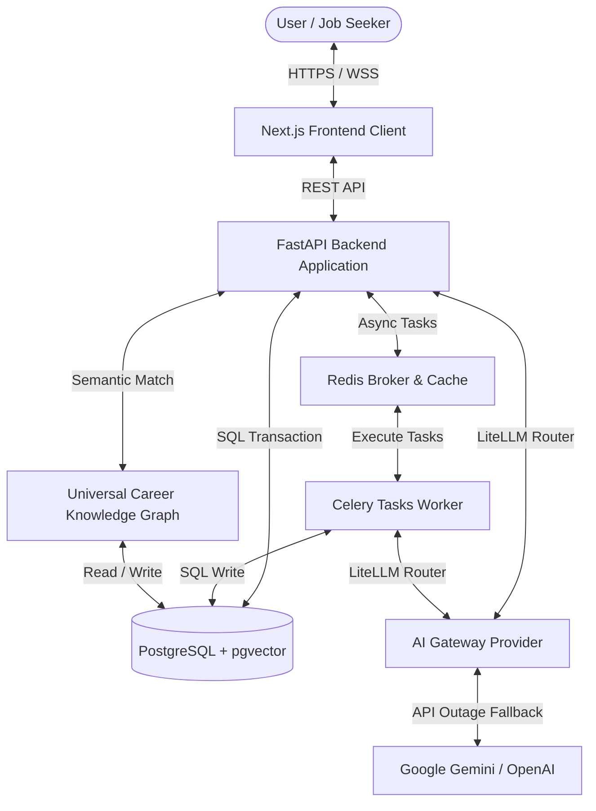

# CareerOS Infinity - AI Career Intelligence Platform

CareerOS Infinity is an enterprise-grade, asynchronous AI Career Intelligence Platform designed to ingest resumes, validate layouts, structure profile data, and run semantic ATS match analytics.

---

## 1. System Architecture (C4 Model)



---

## 2. Technology Stack

*   **Frontend Web Client:** Next.js (v14), TailwindCSS, TypeScript, Zustand.
*   **Backend Server:** FastAPI (Python 3.11), SQLAlchemy (Async), Uvicorn.
*   **Database Platform:** PostgreSQL 15, `pgvector` (HNSW Semantic Indexing).
*   **Asynchronous Processing:** Celery, Redis Broker.
*   **AI Integrations:** LiteLLM Gateway Routing (Google Gemini / OpenAI).
*   **Telemetry & Observability:** Prometheus Client Exporter, Structured JSON Logging.

---

## 3. Local Startup Instructions (Docker Compose)

### 3.1 Prerequisites
Ensure you have [Docker Desktop](https://www.docker.com/products/docker-desktop/) installed and running on your system.

### 3.2 Running the Application
To build and start the entire multi-container service stack (FastAPI, Postgres, Redis, Next.js frontend):
```bash
docker-compose up --build
```

Once initialized, access the following local endpoints:
*   **Web Dashboard UI:** [http://localhost:3000/](http://localhost:3000/)
*   **API Interactive Documentation:** [http://localhost:8000/docs](http://localhost:8000/docs)
*   **Telemetry Exporter metrics:** [http://localhost:8000/api/v1/metrics](http://localhost:8000/api/v1/metrics)

---

## 4. API Reference Overview

```
+-----------------------------------------------------------------------+
|                           Core API Endpoint Routers                   |
+-----------------------------------------------------------------------+
| Method | Endpoint Path              | Scope Description               |
+--------+----------------------------+---------------------------------+
| POST   | /api/v1/auth/register      | User sign up and profile create |
| POST   | /api/v1/auth/token         | User log in, returns secure JWT |
| POST   | /api/v1/resumes/upload     | Upload resume PDF to parse      |
| POST   | /api/v1/jobs/match         | Evaluate ATS Match analysis     |
| GET    | /api/v1/metrics            | Fetch system telemetry metrics  |
+--------+----------------------------+---------------------------------+
```

---

## 5. Development Milestones & Tags
The repository commit history records clear progress validation logs tagged accordingly:
*   `v0.2.0-platform-foundation`: Core Identity services and Postgres database models configured.
*   `v0.3.2-hardened-alpha`: Production hardening, E2E UAT validations, and deployment configs.
