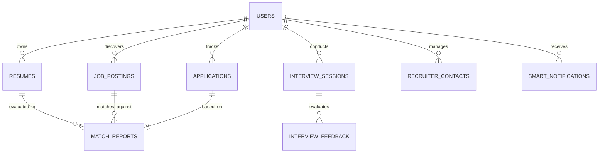

# Database Design & Schema Specifications

## Project Name: CareerOS Infinity
**Document Version:** 1.0.0  
**Status:** Approved  
**Author:** Database Architect Team, CareerOS Infinity  

---

## 1. Entity Relationship Diagram (ERD)

This diagram shows the core relational schema designed for scalability, complete history preservation, and optimized lookup metrics.



---

## 2. Core Relational Schema (PostgreSQL)

### 2.1 Table: `users`
Represents the base authentication and profile entity.

| Column Name | Data Type | Constraints | Description |
| :--- | :--- | :--- | :--- |
| `id` | `UUID` | PRIMARY KEY, Default: `gen_random_uuid()` | Unique identifier |
| `email` | `VARCHAR(255)` | UNIQUE, NOT NULL | User primary email |
| `password_hash`| `VARCHAR(255)` | NOT NULL | Argon2id hash (if not oauth) |
| `full_name` | `VARCHAR(255)` | | User display name |
| `created_at` | `TIMESTAMPTZ` | DEFAULT `now()` | Registration timestamp |
| `updated_at` | `TIMESTAMPTZ` | DEFAULT `now()` | Last profile edit |

### 2.2 Table: `resumes`
Stores the parsed resume structural JSON and raw file reference.

| Column Name | Data Type | Constraints | Description |
| :--- | :--- | :--- | :--- |
| `id` | `UUID` | PRIMARY KEY | Unique identifier |
| `user_id` | `UUID` | FOREIGN KEY -> `users(id)` ON DELETE CASCADE | Owner references |
| `file_url` | `TEXT` | NOT NULL | Location in secure Document Vault |
| `resume_json` | `JSONB` | NOT NULL | Structured extraction schema output |
| `embedding` | `vector(1536)` | | pgvector embeddings of skills/experience |
| `created_at` | `TIMESTAMPTZ` | DEFAULT `now()` | Upload time |

### 2.3 Table: `job_postings`
Aggregated job descriptions matching prospective targets.

| Column Name | Data Type | Constraints | Description |
| :--- | :--- | :--- | :--- |
| `id` | `UUID` | PRIMARY KEY | Unique identifier |
| `title` | `VARCHAR(255)` | NOT NULL | Job Title |
| `company` | `VARCHAR(255)` | NOT NULL | Company name |
| `description` | `TEXT` | NOT NULL | Raw Job Description text |
| `embedding` | `vector(1536)` | | pgvector embeddings of the JD text |
| `source_url` | `TEXT` | | Original posting link |
| `created_at` | `TIMESTAMPTZ` | DEFAULT `now()` | Scraping date |

### 2.4 Table: `applications`
Tracks job progression stages.

| Column Name | Data Type | Constraints | Description |
| :--- | :--- | :--- | :--- |
| `id` | `UUID` | PRIMARY KEY | Unique identifier |
| `user_id` | `UUID` | FOREIGN KEY -> `users(id)` | User reference |
| `job_posting_id`| `UUID` | FOREIGN KEY -> `job_postings(id)` | Job reference |
| `stage` | `VARCHAR(50)` | CHECK (`stage` IN ('Applied', 'Screen', 'Technical', 'Loop', 'Offer', 'Rejected')) | Active pipeline step |
| `applied_date` | `DATE` | DEFAULT `current_date` | Action date |
| `notes` | `TEXT` | | User progress journal |

### 2.5 Table: `match_reports`
Scores and ATS keyword alignment records.

| Column Name | Data Type | Constraints | Description |
| :--- | :--- | :--- | :--- |
| `id` | `UUID` | PRIMARY KEY | Unique identifier |
| `resume_id` | `UUID` | FOREIGN KEY -> `resumes(id)` | Input resume reference |
| `job_posting_id`| `UUID` | FOREIGN KEY -> `job_postings(id)` | Target job reference |
| `score` | `INT` | CHECK (`score` BETWEEN 0 AND 100) | Semantic alignment score |
| `keyword_analysis`| `JSONB` | | Missing vs present ATS keyword maps |

---

## 3. Indexing & Vector Search Optimization

### 3.1 Vector Database Config (pgvector)
To execute efficient semantic recommendations:
```sql
-- Enable pgvector extension
CREATE EXTENSION IF NOT EXISTS vector;

-- Create HNSW Index for rapid search over embeddings
CREATE INDEX ON job_postings USING hnsw (embedding vector_cosine_ops) 
WITH (m = 16, ef_construction = 64);
```
Cosine similarity is utilized for job-resume matching due to scale variations in length between resumes and descriptions.

### 3.2 Relational Indexes
```sql
-- Fast index lookup for user applications
CREATE INDEX idx_applications_user_stage ON applications (user_id, stage);

-- Search parsed resume json properties
CREATE INDEX idx_resumes_jsonb_skills ON resumes USING gin ((resume_json->'skills'));
```

---

## 4. Redis Key Configuration & Cache Scheme
*   **User Sessions:** `session:{user_id}` (TTL: 86400s) -> Value: OAuth token details.
*   **Job Discovery Cache:** `job_search:{search_query_hash}:{page}` (TTL: 1800s) -> Value: JSON list of job IDs.
*   **Task Locks:** `lock:parse_resume:{resume_id}` (TTL: 60s) -> Prevents multiple workers processing same files.
