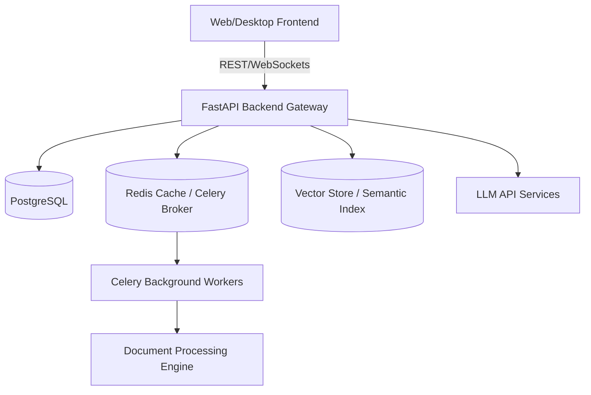

# Software Requirements Specification (SRS)

## Project Name: CareerOS Infinity
**Document Version:** 1.0.0  
**Status:** Approved  
**Author:** Engineering Architecture Team, CareerOS Infinity  

---

## 1. Introduction

### 1.1 Purpose
This document specifies the software requirements for CareerOS Infinity, an enterprise-grade AI Career Operating System. It defines the functional, non-functional, interface, and system execution parameters required for development and testing.

### 1.2 Scope
CareerOS Infinity covers resume analysis, job recommendation engines, simulated chat interviews, resume/cover letter editing, and full applications tracking via background pipelines. The product does not support direct legal recruitment or automated application submissions without explicit user confirmation hooks.

---

## 2. Overall Description

### 2.1 Product Perspective
CareerOS Infinity operates as a self-contained web platform with optional desktop (Electron) wrappers. The backend utilizes FastAPI with PostgreSQL as the relational transactional database, Redis as the cache and broker, and Celery for background workflows. The AI orchestration layers integrate with LLM inference engines (such as Gemini) and use vector databases for similarity mapping.

### 2.2 Product Functions
*   Automatic resume parsing and JSON schema mapping.
*   ATS screening score alignment with actionable recommendations.
*   Semantic job matching against global opportunities.
*   Real-time voice and text mock interview simulations.
*   Secure personal document vaults featuring AES-256 encryption.

### 2.3 User Classes and Characteristics
*   **Active Job Seekers:** Require high-performance tools, low-latency resume iterations, and instant interview drills.
*   **Career Transitioners:** Require heavy use of the Skill Gap Analyzer and Learning Roadmaps.
*   **System Administrators:** Monitor system health, rate limits, API usages, and audit logs.

### 2.4 Design and Implementation Constraints
1.  **Privacy Constrains:** No user documents may be transmitted to external models for training purposes.
2.  **OS Portability:** Application must run on major web browsers (Chrome, Safari, Firefox, Edge) and compile into cross-platform desktop executables.
3.  **Local Execution:** Development setup must run completely locally using Docker Compose configurations.

---

## 3. External Interface Requirements

### 3.1 User Interfaces
*   **Responsive Web Console:** Supporting 4K screens down to mobile layouts using a fluid HSL color scheme, dark/light toggle, and glassmorphic canvas components.
*   **Accessibility:** Strict WCAG 2.1 AA compliance with aria-labels, high-contrast settings, and full keyboard-only navigation pathways.

### 3.2 Software Interfaces
*   **Database:** PostgreSQL 15+ for core transactional state.
*   **Vector Engine:** pgvector extension or standalone instance for job/resume embeddings.
*   **Message Broker:** Redis 7+ for Celery workflows.
*   **External Calendars:** Two-way integration via Google Calendar API and Outlook Calendar REST API.

---

## 4. System Features (Core Feature Modules)

### 4.1 Resume Parser (Module 02)
*   **Description:** The system must parse uploaded PDF or DOCX resume formats and convert them into standard JSON structures.
*   **Functional Input:** Uploaded file binaries.
*   **Processing Rules:**
    1.  Parse using standard text extraction (or OCR if scanned).
    2.  Use LLM structuring prompt to parse name, contacts, skills, work experiences, projects, and education.
    3.  Schema validate against defined Resume JSON structure.
*   **Expected Output:** Structured Resume JSON.

### 4.2 ATS Scorer (Module 03)
*   **Description:** Align resume elements with a target Job Description.
*   **Processing Rules:**
    1.  Extract keywords from job description (e.g., Python, Kubernetes, System Design).
    2.  Cross-reference against parsed Resume JSON.
    3.  Generate dynamic match percentage score (0-100) and identify missing items.

### 4.3 Mock Interview Simulator (Module 12)
*   **Description:** Real-time conversational interview practice.
*   **Processing Rules:**
    1.  Generate interview questions based on active resume and target JD.
    2.  Expose WebSocket connection for streaming text/voice responses.
    3.  Utilize STAR framework evaluation model to rate user responses.

---

## 5. Non-Functional Requirements

### 5.1 Security Requirements
*   **E2E Encryption:** Encrypt Resume/Document files on disk using AES-256.
*   **Auth Standards:** Require passwordless Passkey (WebAuthn) or secure JWT with SHA-256 signatures.
*   **Audit Trailing:** Log all credential edits, exports, and document deletions into transactional audit tables.

### 5.2 Performance Requirements
*   **Dashboard Loading:** First Contentful Paint (FCP) must resolve under 1.2 seconds.
*   **Resume Parsing Processing Time:** Parse execution must return structured JSON within 3.5 seconds.
*   **Semantic Scoring Query Latency:** System match results must return in under 600ms for 100,000 index items.

### 5.3 Reliability and Availability
*   **Uptime:** Target 99.9% application availability excluding scheduled maintenance.
*   **Fault Tolerance:** Failure in downstream LLM provider APIs must trigger a graceful fallback (cached responses or system offline message) without crashing the server.
