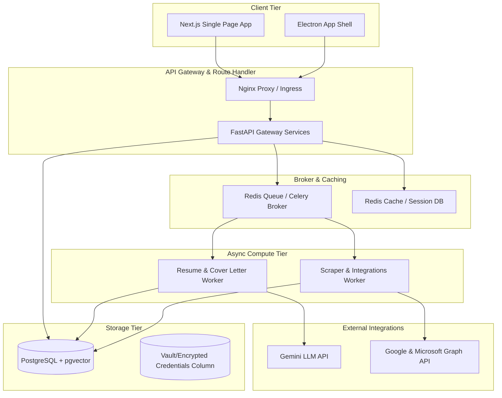
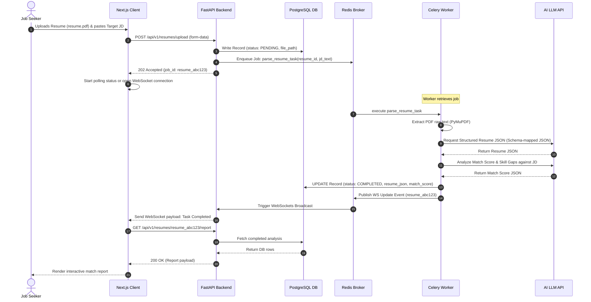

# System Design & Architecture Document

## Project Name: CareerOS Infinity
**Document Version:** 1.0.0  
**Status:** Approved  
**Author:** Chief Architect, CareerOS Infinity  

---

## 1. System Architecture (HLD)

The application is structured as a cloud-native, microservices-ready monolithic structure with separated front-end client and background workers.



---

## 2. Sequence Diagram: Resume Parsing & ATS Optimization (LLD)

This sequence diagram depicts the exact interactions required to upload a resume, execute async parsing, and trigger ATS screening scores.



---

## 3. Directory Layout & Folder Structure

To ensure consistency across teams, the workspace must be organized using the following structure:

```
c:\Users\kadam\Downloads\CareerOS\
├── docs/                      # Core System Specs (PRD, SRS, TRD, etc.)
├── backend/                   # FastAPI Backend Application
│   ├── app/
│   │   ├── core/              # Config, Security, Database connection configs
│   │   ├── domains/           # DDD Domain Layer (Aggregates, Entities, Values)
│   │   │   ├── user/
│   │   │   ├── resume/
│   │   │   ├── job/
│   │   │   └── interview/
│   │   ├── repositories/      # Repository implementations (SQLAlchemy, Vector)
│   │   ├── services/          # Core Business logic operations
│   │   ├── workers/           # Celery Task handlers and definitions
│   │   ├── api/               # Router definitions & REST controllers
│   │   └── main.py            # FastAPI Entry Point
│   ├── tests/                 # Unit & Integration Tests
│   ├── requirements.txt       # Dependencies
│   └── Dockerfile             # Production Backend Build
├── frontend/                  # Next.js Frontend Application
│   ├── src/
│   │   ├── app/               # Next.js App Router (pages & layouts)
│   │   ├── components/        # Reusable design system widgets
│   │   │   ├── ui/            # Buttons, dialogs, cards (styled with CSS variables)
│   │   │   ├── dashboard/     # Widget components
│   │   │   └── chat/          # Sidebar AI chat interfaces
│   │   ├── hooks/             # Zustand states & TanStack Query integrations
│   │   ├── utils/             # Formatters, keyboard shortcut managers
│   │   └── styles/            # global.css holding Tailwind configurations
│   ├── tests/                 # Playwright & Jest test files
│   ├── package.json           # Dependencies
│   └── Dockerfile             # Production Frontend Build
└── docker-compose.yml         # Complete local developer run environment
```

---

## 4. Security & Cryptographic Details
1.  **Transport Security:** HTTPS (TLS 1.3) enforced on Nginx level.
2.  **Sensitive Secrets Storage:** User API tokens (for external integrations) are encrypted at-rest using **Fernet Symmetric Cryptography**.
    *   The decryption key is loaded strictly from the environment runtime secret storage (`SECRET_ENCRYPTION_KEY`), never stored in database or file code.
3.  **Role-Based Access Control (RBAC):** Every endpoint uses a dependency-based validator `PermissionChecker([Permission.READ_RESUME, Permission.WRITE_RESUME])` to guard access.
