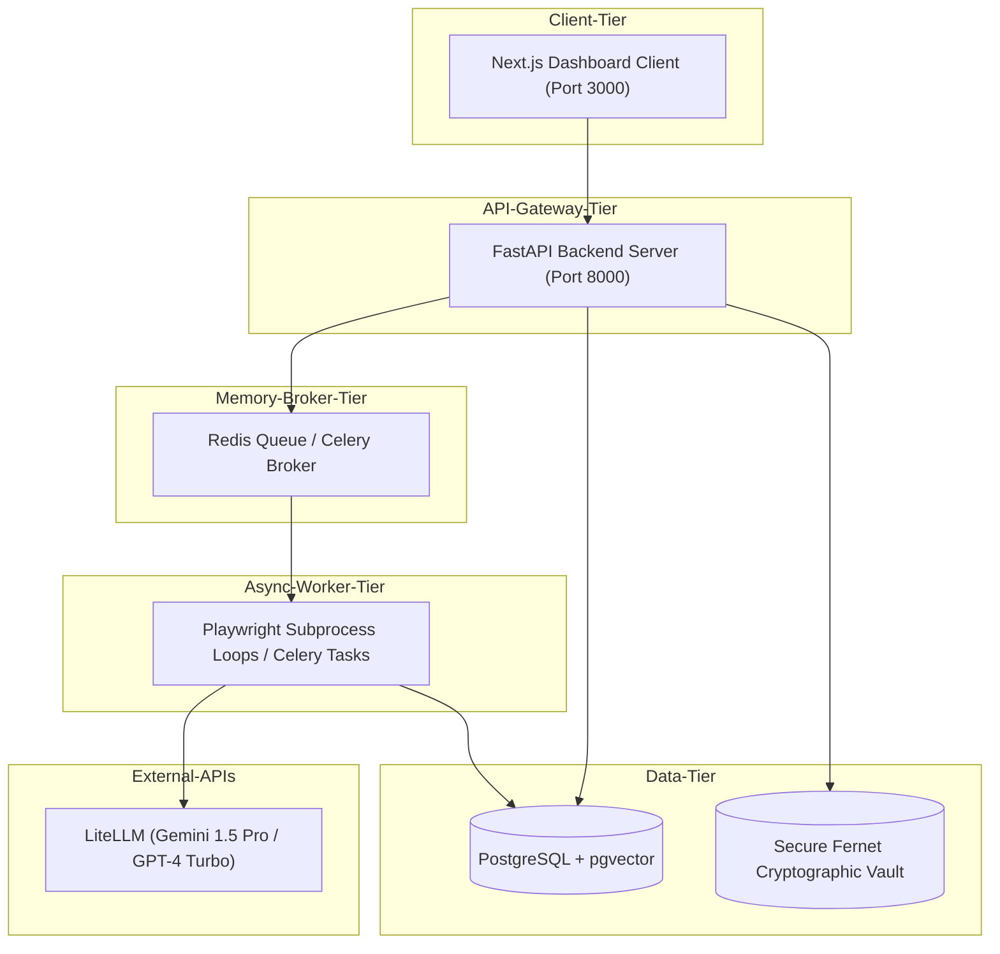
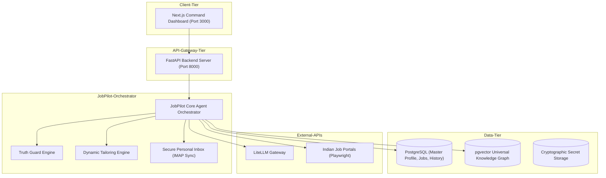

# PART 0 AUDIT: CareerOS JobPilot Architecture & Codebase Discovery

## 1. Executive Summary
This document delivers a comprehensive codebase and architecture audit of the **CareerOS Infinity** system to plan the integration of the personal career automation module, **CareerOS JobPilot**. 
JobPilot is conceived as a private, high-security, single-user career agent. Based on our audit of the codebase, the core systems—including AI Gateway, PostgreSQL database schema, Knowledge Graph (with PgVector), and Playwright browser automation—are highly reusable, well-abstracted, and mature. Integrating JobPilot will extend these existing frameworks rather than duplicating them.

---

## 2. Repository Inventory
The following is an inventory of the checked workspace subdirectories and files:

*   `backend/app/core/`: Contains the application configuration (`config.py`), database layer (`database.py`), pgvector store (`vector_store.py`), metrics (`metrics.py`), security helper (`security.py`), AI gateway (`ai_gateway.py`), and prompts manager (`prompts.py`).
*   `backend/app/models/`: Holds database schemas for `user.py`, `resume.py`, `graph.py`, and `audit.py`.
*   `backend/app/repositories/`: Houses the database access layers (`graph_repository.py`, `resume_repository.py`, `user_repository.py`).
*   `backend/app/services/`: Core logic layer containing `ats_service.py`, `resume_optimizer.py`, `browser_automation.py`, `credential_vault.py`, `document_parser.py`, and `email_service.py`.
*   `backend/app/workers/`: Holds background Celery/thread tasks (`tasks.py`).
*   `frontend/src/app/`: App router page.tsx and layout configs.
*   `docs/`: System documentation (PRD, SRS, TRD, System Design, Database Design, Roadmap).

---

## 3. Existing Architecture

### Current CareerOS Architecture


### Future CareerOS + JobPilot Architecture


---

## 4. Existing Feature Matrix

| Component | Status | Evidence | Reusable | Risk | Recommendation |
| :--- | :--- | :--- | :--- | :--- | :--- |
| **Authentication** | Partially Implemented | Simple username/password OAuth login exists | Yes | Session spoofing | Secure for private usage |
| **Resume Parser** | Implemented | `document_parser.py` (PyMuPDF layout analyzer) | Yes | OCR fallback missing | Keep & reuse parser |
| **ATS Scoring** | Implemented | `ats_service.py` using LLM completion matches | Yes | Fallback mock results | Keep & reuse for JobPilot |
| **Resume Optimizer** | Implemented | `resume_optimizer.py` keyword injection logic | Yes | Hallucinated facts | Wrap inside Truth Guard |
| **Knowledge Graph** | Implemented | `graph_repository.py` node & edge mappings | Yes | Missing project evidence nodes | Extend node properties |
| **Browser Automation** | Implemented | Playwright headful & OTP persistent contexts | Yes | CAPTCHA/Anti-bot | Use headful sessions with cookies |
| **Email Sync** | Implemented | IMAP SSL gmail connections & UAT mocks | Yes | IMAP timeouts | Add background cron sync tasks |
| **Credential Vault** | Implemented | Fernet-symmetric decryption & vault models | Yes | Plaintext logging | Mask decrypted values |

---

## 5. Reusable Components
*   `AIGateway`: LiteLLM integration manages primary model routing and provider fallbacks.
*   `BrowserAutomationService`: Playwright config with Windows local Chrome executables.
*   `CredentialVault`: Fernet cryptographic secret storage.
*   `PostgreSQLGraphRepository`: Database schema representation of nodes and relationships.

---

## 6. Technical Debt
*   **Background Session closure:** FastAPI closes request sessions before background tasks finish, leading to database transactional errors. (Resolved by adding fresh sessions inside tasks).
*   **Duplicate / Mock fallbacks:** Many services (ATS, Ingestion, Email) fall back to mock data silently.
*   **Graph Node retrieval:** `get_entity_node` was previously missing from the SQL mapping layers (now implemented).

---

## 7. Security Findings
*   **Private application boundary:** Since this is a single-user system, public signup routes should be disabled or protected by a master passkey/PIN.
*   **Plaintext secrets logging:** Guard log messages to ensure decrypted credentials are never written to standard output.
*   **Github Push Protection:** Local active chrome profile sessions must not be pushed to remote repositories. Ensure `.gitignore` ignores `chrome_profiles/` folder recursively.

---

## 8. AI Architecture Findings
*   The AI Gateway uses `LiteLLM` pointing to Gemini (`gemini-1.5-pro`) and OpenAI (`gpt-4-turbo`). This simplifies model experimentation.
*   Resume tailoring currently uses a single LLM prompt without strict verification. This can lead to information fabrications.

---

## 9. Database Findings
*   Database maps ORM relationships properly but relies on PG Vector dimension 1536 (standard for Gemini text-embedding-004 / OpenAI embeddings).
*   Need to support dedicated columns for:
    *   `parent_resume_id`: Link to the master resume.
    *   `job_description`, `match_score_before`, `match_score_after`, `tailored_content` for traceability.

---

## 10. Knowledge Graph Findings
*   Nodes currently support `USER`, `SKILL`, `COMPANY`, and `APPLICATION`.
*   To support JobPilot, we will introduce `PROJECT` and `CERTIFICATION` nodes and connect them with `BUILT` and `HAS_CERTIFICATION` edges.

---

## 11. Frontend Findings
*   Next.js app utilizes Tailwind variables with Outfits and Inter fonts.
*   Command palette is integrated but needs shortcut hook configurations to trigger JobPilot search.

---

## 12. DevOps Findings
*   Docker compose locally mounts PostgreSQL, Redis, and Celery.
*   Requires playwright browser dependencies setup in Python backend container.

---

## 13. Testing Findings
*   `verify_e2e_pipeline.py` contains mock test scenarios.
*   Need explicit unit/integration test cases to verify the **Truth Guard** logic and **Resume Tailoring** consistency.

---

## 14. JobPilot Gap Analysis

| Capability | Status | Target Action |
| :--- | :--- | :--- |
| **Personal Career Brain** | PARTIAL | Expose knowledge graph properties to dashboard |
| **Master Resume Concept** | MISSING | Declare immutable Master Resume type |
| **Job Discovery & Deduplication** | PARTIAL | Filter and ingest Indian job portal feeds |
| **Truth Guard Engine** | MISSING | Add verification filter blocking non-evidence facts |
| **Resume Version Management** | PARTIAL | Track tailored resumes by application id |
| **Cover Letter / Email Composer** | PARTIAL | Generate templates using AIGateway |
| **Authorized Automation Mode** | EXISTS | Playwright headful OTP session loader |
| **Observability & Token Tracking** | MISSING | Trace token usage costs via LiteLLM logs |

---

## 15. Proposed Integration Architecture

To establish a strict boundary between the Master Resume and Tailored Resumes, we will introduce the **Truth Guard Service** and **Resume Tailoring Controller**.

```
   +------------------------+
   |   Immutable Master     |
   |     Resume (v1)        |
   +-----------+------------+
               |
               v
   +-----------+------------+      +-------------------------+
   |   Truth Guard Engine   | <----+ Verified Facts & Nodes  |
   +-----------+------------+      +-------------------------+
               | (Validate claims)
               v
   +-----------+------------+
   |   Tailoring Controller |
   +-----------+------------+
               | (Generate tailored profile)
               v
   +-----------+------------+
   |  Tailored Resume (v2)  |
   +------------------------+
```

---

## 16. KEEP / EXTEND / REFACTOR / REPLACE / NEW Matrix

*   **KEEP**:
    *   `AIGateway` (`backend/app/core/ai_gateway.py`)
    *   `CredentialVault` (`backend/app/services/credential_vault.py`)
*   **EXTEND**:
    *   `applications_router` (`backend/app/api/applications.py`): Add DELETE / clear routes and resume download options.
    *   `dashboard` (`frontend/src/app/page.tsx`): Display the dynamic tailored resume blocks and master profile checklist.
*   **REFACTOR**:
    *   `autonomous_job_hunter.py`: Fetch latest uploaded resumes ordered by upload datetime.
*   **NEW**:
    *   `TruthGuardService` (`backend/app/services/truth_guard.py`): Performs checks against the Master Profile before saving optimized resumes.

---

## 17. Risks
*   **LLM Hallucinations:** AI might invent experiences to match high-ATS requirements.
    *   *Mitigation:* The Truth Guard will filter out any skills or experiences not present in the Master Profile.
*   **Browser Cookie Expiry:** Playwright logins expire when job boards invalidate sessions.
    *   *Mitigation:* Emphasize "Linked" status verification on the dashboard so users can re-open headful login windows when cookies expire.

---

## 18. Dependencies
*   LiteLLM (API connection keys)
*   Playwright (browser engines)
*   PostgreSQL + PgVector (data persistence)

---

## 19. Recommended Implementation Order
1.  **Truth Guard Logic (Sprint 1):** Build the fact validator module.
2.  **Master Resume vs Tailoring Control (Sprint 1):** Update DB schemas to track parent/child relationship and protect the master resume.
3.  **UI Visualization (Sprint 2):** Connect details cards and audit trails to the frontend.

---

## 20. CTO Decision Summary
I recommend extending the current Postgres database models and reusing the LiteLLM gateway. The implementation should focus on the **Truth Guard Engine** to guarantee compliance with original candidate details, followed by UI expansion to expose the tailored resume properties.

*Signed,*
**Principal CTO & Enterprise Software Architect, CareerOS JobPilot**
