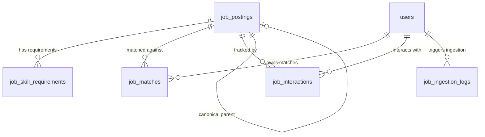

# CareerOS JobPilot — Part 2 Database Design

**Module**: Job Intelligence Database Schema & Entities  
**Migration ID**: `a1b2c3d4e5f6`  
**Date**: August 13, 2026  

---

## 1. Relational Entities Summary

Part 2 extends PostgreSQL with 1 extended table and 4 new intelligence tables.

---

## 2. Table Schemas

### 2.1 `job_postings` (Extended)

| Column | Type | Constraints | Description |
|--------|------|-------------|-------------|
| `id` | UUID | Primary Key | Job posting unique ID |
| `title` | VARCHAR(255) | NOT NULL | Job title |
| `company` | VARCHAR(255) | NOT NULL | Company name |
| `description` | TEXT | NOT NULL | Plain-text safe job description |
| `source` | VARCHAR(100) | NOT NULL, Index | Source provider (e.g., 'manual') |
| `source_job_id` | VARCHAR(255) | Nullable, Index | External provider job ID |
| `source_url` | VARCHAR(1024) | Nullable | Verified safe URL |
| `location` | VARCHAR(500) | Nullable, Index | Location city/region |
| `work_mode` | VARCHAR(50) | Nullable, Index | REMOTE / HYBRID / ONSITE |
| `employment_type` | VARCHAR(50) | Nullable | FULL_TIME / PART_TIME / CONTRACT / INTERNSHIP |
| `seniority_level` | VARCHAR(50) | Nullable | ENTRY / MID / SENIOR / LEAD / PRINCIPAL / STAFF |
| `experience_min_years` | INT | Nullable | Minimum experience required |
| `experience_max_years` | INT | Nullable | Maximum experience required |
| `salary_min` | FLOAT | Nullable | Minimum salary |
| `salary_max` | FLOAT | Nullable | Maximum salary |
| `salary_currency` | VARCHAR(10) | Default 'INR' | Currency code |
| `posted_at` | TIMESTAMPTZ | Nullable, Index | Original posting timestamp |
| `discovered_at` | TIMESTAMPTZ | NOT NULL | Discovery timestamp |
| `status` | VARCHAR(50) | NOT NULL, Index | ACTIVE / EXPIRED / REMOVED / DUPLICATE |
| `quality_status` | VARCHAR(50) | NOT NULL, Index | HIGH / MEDIUM / LOW / EXPIRED / SUSPICIOUS |
| `quality_score` | FLOAT | Nullable | Quality score (0-100) |
| `raw_content_hash` | VARCHAR(64) | Nullable, Index | SHA-256 hash of normalized description |
| `canonical_job_id` | UUID | FK(job_postings.id) | Pointer to primary job if duplicate |
| `is_canonical` | BOOLEAN | NOT NULL, Default TRUE | Flag indicating canonical status |
| `normalized_title` | VARCHAR(255) | Nullable, Index | Case/punctuation stripped title |
| `normalized_company` | VARCHAR(255) | Nullable, Index | Case/punctuation stripped company |
| `jd_intelligence` | JSONB | Nullable | Full extracted structured intelligence |
| `embedding` | Vector(1536) | Nullable | Semantic vector representation |

### 2.2 `job_skill_requirements`

| Column | Type | Constraints | Description |
|--------|------|-------------|-------------|
| `id` | UUID | Primary Key | Requirement unique ID |
| `job_id` | UUID | FK(job_postings.id ON DELETE CASCADE), Index | Parent job posting |
| `skill_name` | VARCHAR(255) | NOT NULL | Raw extracted skill name |
| `normalized_skill` | VARCHAR(255) | Nullable, Index | Canonical skill alias |
| `skill_type` | VARCHAR(50) | NOT NULL, Index | REQUIRED / PREFERRED / NICE_TO_HAVE |
| `proficiency_level` | VARCHAR(50) | Nullable | Required proficiency |
| `is_primary` | BOOLEAN | NOT NULL, Default FALSE | Primary core requirement flag |

### 2.3 `job_matches`

| Column | Type | Constraints | Description |
|--------|------|-------------|-------------|
| `id` | UUID | Primary Key | Match record ID |
| `user_id` | UUID | FK(users.id ON DELETE CASCADE), Index | Target user |
| `job_id` | UUID | FK(job_postings.id ON DELETE CASCADE), Index | Matched job posting |
| `ats_score` | FLOAT | Nullable | ATS keyword coverage score (0-100) |
| `semantic_score` | FLOAT | Nullable | Vector similarity score (0-100) |
| `skill_match_score` | FLOAT | Nullable | Skill overlap score (0-100) |
| `experience_match_score` | FLOAT | Nullable | Experience years alignment (0-100) |
| `role_match_score` | FLOAT | Nullable | Target role alignment (0-100) |
| `project_relevance_score` | FLOAT | Nullable | Tech stack project overlap (0-100) |
| `location_match_score` | FLOAT | Nullable | Work mode & location score (0-100) |
| `career_preference_score` | FLOAT | Nullable | Preferences alignment (0-100) |
| `overall_fit_score` | FLOAT | Nullable, Index | Weighted overall score (0-100) |
| `recommendation_level` | VARCHAR(50) | Nullable, Index | APPLY_RECOMMENDED, etc. |
| `matched_skills` | JSONB | Nullable | List of matched canonical skills |
| `missing_required_skills` | JSONB | Nullable | **Job-specific missing required skills** |
| `missing_preferred_skills` | JSONB | Nullable | **Job-specific missing preferred skills** |
| `match_explanation` | TEXT | Nullable | Human-readable reasoning summary |
| `score_weights` | JSONB | Nullable | Weight configuration snapshot |
| `calculated_at` | TIMESTAMPTZ | NOT NULL | Computation timestamp |
| `is_stale` | BOOLEAN | NOT NULL, Default FALSE | Staleness flag |

*Unique Constraint*: `uq_user_job_match` on `(user_id, job_id)`.

### 2.4 `job_interactions`

| Column | Type | Constraints | Description |
|--------|------|-------------|-------------|
| `id` | UUID | Primary Key | Interaction ID |
| `user_id` | UUID | FK(users.id ON DELETE CASCADE), Index | User |
| `job_id` | UUID | FK(job_postings.id ON DELETE CASCADE), Index | Job posting |
| `status` | VARCHAR(50) | NOT NULL, Index | DISCOVERED / VIEWED / SAVED / DISMISSED / SHORTLISTED / APPLIED |
| `notes` | TEXT | Nullable | User notes for job |
| `interacted_at` | TIMESTAMPTZ | NOT NULL | Last interaction timestamp |

*Unique Constraint*: `uq_user_job_interaction` on `(user_id, job_id)`.

### 2.5 `job_ingestion_logs`

| Column | Type | Constraints | Description |
|--------|------|-------------|-------------|
| `id` | UUID | Primary Key | Log ID |
| `source` | VARCHAR(100) | NOT NULL, Index | Source provider |
| `ingested_by_user_id` | UUID | FK(users.id ON DELETE SET NULL) | User triggering ingestion |
| `ingested_at` | TIMESTAMPTZ | NOT NULL, Index | Execution timestamp |
| `jobs_found` | INT | NOT NULL, Default 0 | Count found |
| `jobs_normalized` | INT | NOT NULL, Default 0 | Count successfully stored |
| `jobs_rejected` | INT | NOT NULL, Default 0 | Count rejected |
| `duplicates_detected` | INT | NOT NULL, Default 0 | Count duplicates found |
| `errors` | JSONB | Nullable | Error dictionary |
