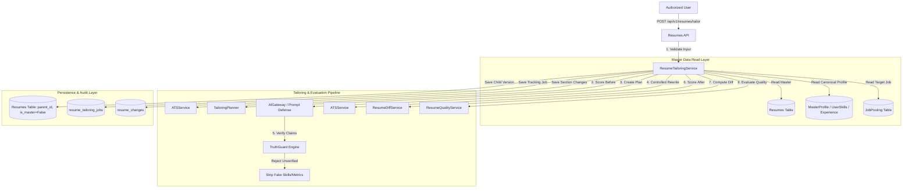

# CareerOS JobPilot — Part 3 Architecture Specification

**Module**: Smart Resume Tailoring Architecture  
**Status**: FROZEN & APPROVED  
**Date**: August 13, 2026  

---

## 1. Pipeline Architecture Diagram



---

## 2. Version Lineage Model

```
[ Master Resume v1 (is_master=True, ACTIVE) ]
          │
          ├── [ Tailored Resume v1 — TechCorp (READY_FOR_REVIEW) ]
          ├── [ Tailored Resume v2 — Acme Inc (APPROVED) ]
          └── [ Tailored Resume v3 — Global Solutions (REJECTED) ]
```

---

## 3. TruthGuard Claim Validation Flow

Every AI-generated section change passes through TruthGuard before inclusion:
1. Skills must exist in `UserSkill` with status `VERIFIED` or `USER_PROVIDED` (or in Master Profile).
2. Unverified skills (e.g. Kafka, Spark) are stripped and logged in `missing_skills`.
3. Experiences & Projects are validated against `Experience` and `Project` records.
