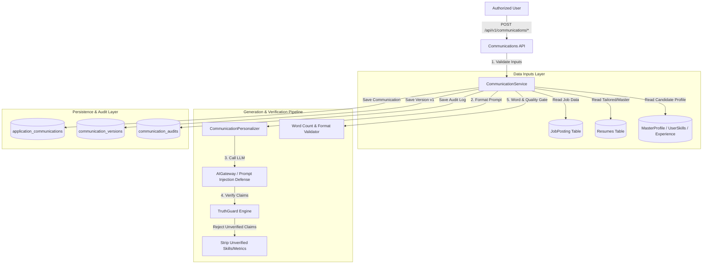

# CareerOS JobPilot — Part 4 Architecture Specification

**Module**: Application Communication Engine Architecture  
**Status**: FROZEN & APPROVED  
**Date**: August 13, 2026  

---

## 1. System Architecture Diagram

---

## 2. Status Transition Lifecycle

$$\text{GENERATING} \longrightarrow \text{READY\_FOR\_REVIEW} \begin{cases} \stackrel{\text{User Edit}}{\longrightarrow} \text{EDITED} \longrightarrow \text{APPROVED} \\ \stackrel{\text{User Approve}}{\longrightarrow} \text{APPROVED (Immutable)} \\ \stackrel{\text{User Reject}}{\longrightarrow} \text{REJECTED (ARCHIVED)} \end{cases}$$
