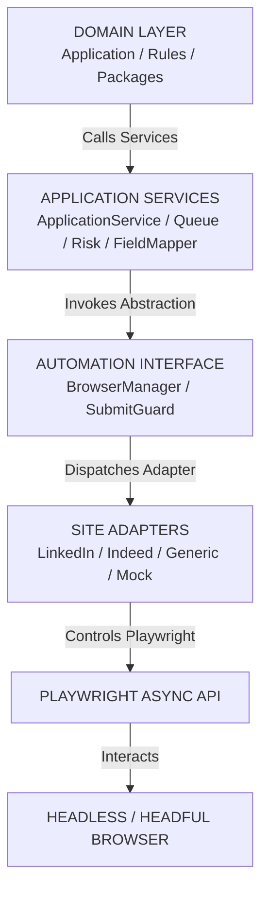

# CareerOS JobPilot — Part 5 Architecture Specification

**Module**: Layered Application & Automation Architecture  
**Status**: FROZEN & APPROVED  
**Date**: August 13, 2026  

---

## 1. System Layer Diagram

---

## 2. Application Status Lifecycle

$$\text{DISCOVERED} \rightarrow \text{QUALIFIED} \rightarrow \text{PACKAGE\_GENERATED} \rightarrow \text{READY\_FOR\_REVIEW} \stackrel{\text{L1 Approval}}{\longrightarrow} \text{USER\_APPROVED} \rightarrow \text{AUTOMATION\_RUNNING} \rightarrow \text{READY\_TO\_SUBMIT} \stackrel{\text{L2 Final Approval}}{\longrightarrow} \text{SUBMITTED} \rightarrow \text{SUBMISSION\_VERIFIED} \rightarrow \text{TRACKING}$$
