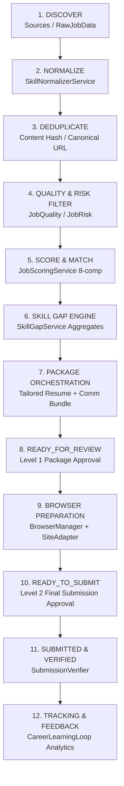

# CareerOS JobPilot — Part 6 Architecture Specification

**Module**: Autonomous Orchestrator System Architecture  
**Date**: August 13, 2026  

---

## 1. System Pipeline

```mermaid
graph TD
    Discover[1. DISCOVER\nSources / RawJobData] --> Normalize[2. NORMALIZE\nSkillNormalizerService]
    Normalize --> Dedup[3. DEDUPLICATE\nContent Hash / Canonical URL]
    Dedup --> Filter[4. QUALITY & RISK FILTER\nJobQuality / JobRisk]
    Filter --> Score[5. SCORE & MATCH\nJobScoringService 8-comp]
    Score --> SkillGap[6. SKILL GAP ENGINE\nSkillGapService Aggregates]
    SkillGap --> Package[7. PACKAGE ORCHESTRATION\nTailored Resume + Comm Bundle]
    Package --> Review[8. READY_FOR_REVIEW\nLevel 1 Package Approval]
    Review --> Prep[9. BROWSER PREPARATION\nBrowserManager + SiteAdapter]
    Prep --> FinalApproval[10. READY_TO_SUBMIT\nLevel 2 Final Submission Approval]
    FinalApproval --> Submit[11. SUBMITTED & VERIFIED\nSubmissionVerifier]
    Submit --> Tracking[12. TRACKING & FEEDBACK\nCareerLearningLoop Analytics]
```
