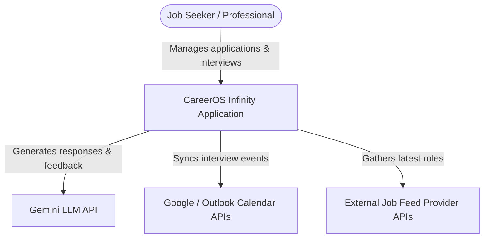
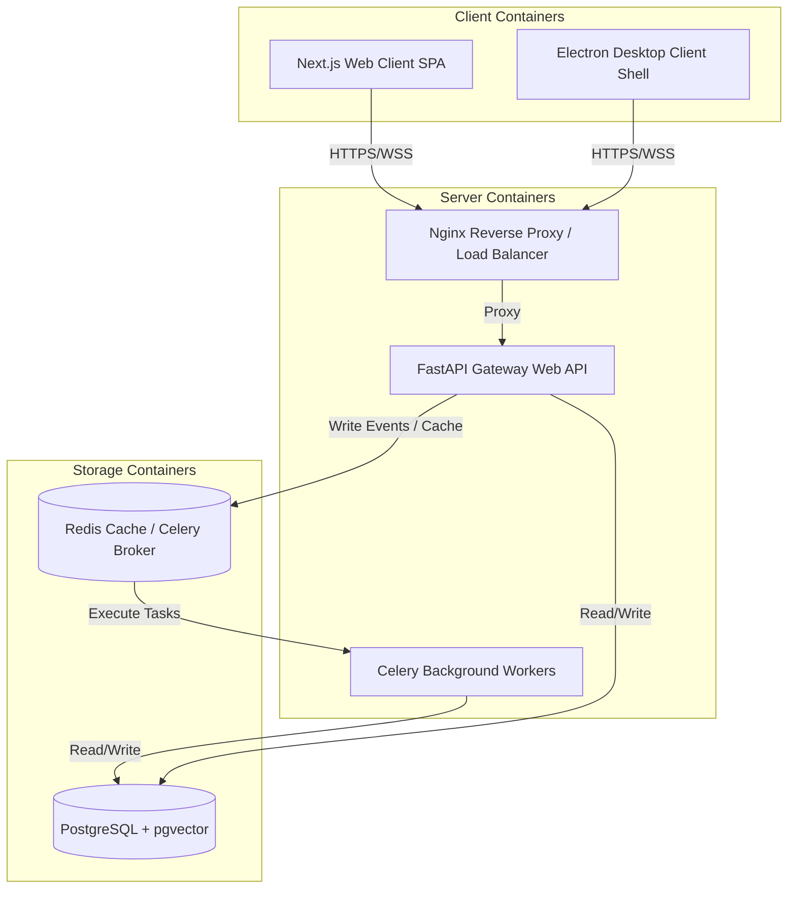
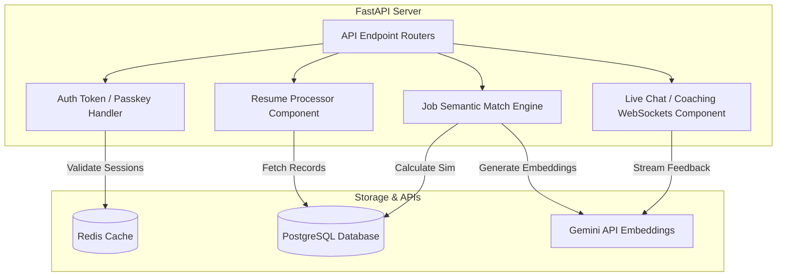
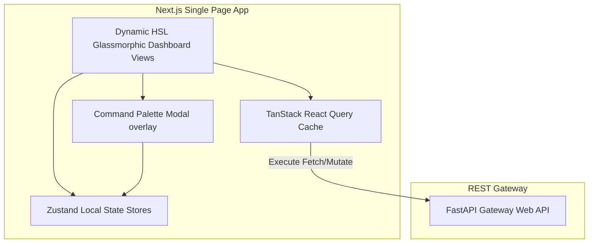

# CareerOS Infinity - C4 Architecture Models

This document defines the system topology across the four design boundaries of the C4 architecture model.

---

## 1. System Context Diagram (Level 1)

Defines the system context and interaction boundaries between users and external systems.

---

## 2. Container Diagram (Level 2)

Deconstructs the application into running container boundaries.

---

## 3. Component Diagram (Level 3 - FastAPI Backend API)

Deconstructs the API container into functional software components.

---

## 4. Component Diagram (Level 3 - Next.js Frontend App)

Deconstructs the Frontend container into design-system components and state containers.

