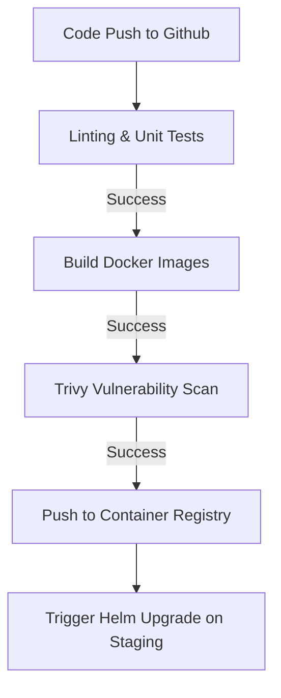

# CareerOS Infinity - DevOps & Deployment Blueprint

## 1. Environment Tiers Configuration

CareerOS Infinity uses a consistent environment deployment model to guarantee compatibility from local coding steps to live cloud production runs.

```
+--------------------+      Deploys To     +--------------------+      Deploys To     +--------------------+
| Local Dev (Docker) | ------------------> |  Staging (K8s)     | ------------------> |  Production (K8s)  |
+--------------------+                     +--------------------+                     +--------------------+
```

### 1.1 Local Development
*   **Infrastructure:** Orchestrated via `docker-compose.yml`.
*   **Stack:** Python API Container, Node Web client, PostgreSQL + pgvector container, Redis container.
*   **Storage:** Local directories mapped into container volumes for persistent developer updates.

### 1.2 Staging / QA Environment
*   **Infrastructure:** Deployed to a dedicated Kubernetes namespace (`careeros-staging`).
*   **Provisioning:** Managed using lightweight Helm charts matching production structures.

### 1.3 Production Environment
*   **Infrastructure:** Multi-region Kubernetes cluster running on managed cloud services.
*   **Autoscaling:** HPA (Horizontal Pod Autoscaling) monitoring CPU utilization (scale out at 75% CPU load) and active WebSocket connection count limit thresholds.

---

## 2. CI/CD Architecture (GitHub Actions)

The deployment pipeline is triggered automatically upon push events to main or release branches.



### 2.1 Quality Gates inside the Pipeline
*   **Linting:** Pre-commit style validations (Black, Flake8, ESLint).
*   **Tests:** PyTest and Jest test runners must complete with a 100% pass rate.
*   **Security:** Container images are scanned by Trivy. Builds containing High or Critical CVE tags are rejected automatically.

---

## 3. Observability & Logging Strategy

### 3.1 Metrics Ingestion (Prometheus & Grafana)
We export metrics through predefined endpoints:
*   **FastAPI API Server:** `/metrics` endpoint exports HTTP request total counts, response latency histograms (FCP/TTFB targets), and active WebSocket connection logs.
*   **Celery Workers:** Expose queues lengths, task processing times, and failure/success ratios.
*   **PostgreSQL Engine:** Monitored via pg_exporter (connection pool sizing, lock alerts, and vector search indices efficiency).

### 3.2 Structured Logging
The backend uses JSON structured logging to stdout:
```json
{
  "timestamp": "2026-08-08T07:15:00Z",
  "level": "INFO",
  "logger": "app.api.resumes",
  "message": "Resume parsed successfully.",
  "user_id": "8f3b9d0e-2a4c-47bc-98de-51d07f3ea0d4",
  "execution_time_ms": 3200
}
```

---

## 4. Disaster Recovery & Backup Plan

*   **Relational Database Backups:** Automated daily pg_dump schedules uploaded to secure, access-controlled cloud buckets. Backups are retained for 30 days.
*   **Point-in-Time Recovery (PITR):** Write-Ahead Logging (WAL) files are archived hourly to allow restoring state to any minute within the previous 7 days.
*   **Document Vault Backup:** The local files directory utilizes multi-region replication to protect user resumes from hardware failures.
*   **Recovery Objective Targets:**
    *   **Recovery Point Objective (RPO):** Maximum 1 hour of potential transaction log loss.
    *   **Recovery Time Objective (RTO):** System recovered and operational within 4 hours in the event of major regional outage.
